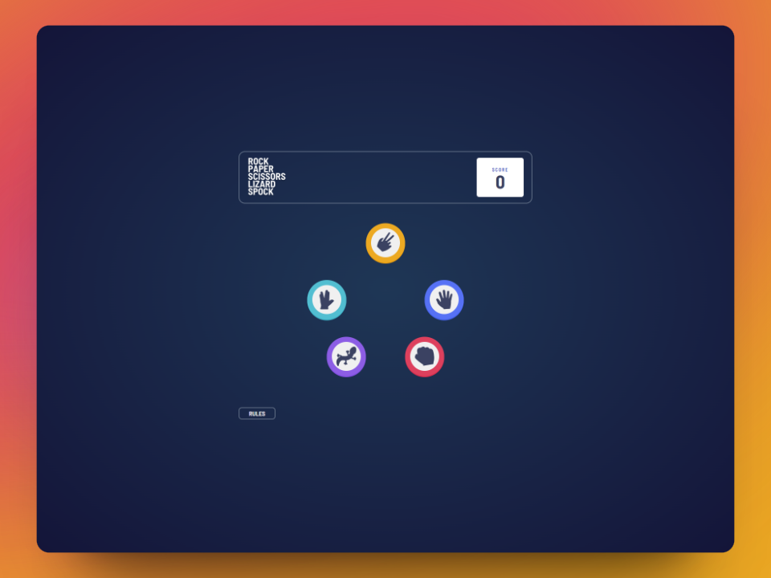

# Frontend Mentor - Rock, Paper, Scissors solution

This is a solution to the [Rock, Paper, Scissors challenge on Frontend Mentor](https://www.frontendmentor.io/challenges/rock-paper-scissors-game-pTgwgvgH). Frontend Mentor challenges help you improve your coding skills by building realistic projects. 

## Table of contents

- [Frontend Mentor - Rock, Paper, Scissors solution](#frontend-mentor---rock-paper-scissors-solution)
  - [Table of contents](#table-of-contents)
  - [Overview](#overview)
    - [The challenge](#the-challenge)
    - [Screenshot](#screenshot)
    - [Links](#links)
  - [My process](#my-process)
    - [Built with](#built-with)
    - [Useful resources](#useful-resources)
  - [Author](#author)

## Overview

### The challenge

Users should be able to:

- View the optimal layout for the game depending on their device's screen size
- Play Rock, Paper, Scissors against the computer
- **Bonus**: Play Rock, Paper, Scissors, Lizard, Spock against the computer 

### Screenshot

### Links

- Solution URL: [https://github.com/isafdezpe/rock-paper-scissors-game](https://github.com/isafdezpe/rock-paper-scissors-game)
- Live Site URL: [https://isafdezpe.github.io/rock-paper-scissors-game/](https://isafdezpe.github.io/rock-paper-scissors-game/)

## My process

### Built with

- HTML5 
- CSS
- Flexbox
- Javascript
  

### Useful resources

- [MDN Web Docs](https://developer.mozilla.org/en-US/docs/Web/CSS)

## Author

- Frontend Mentor - [@isafdezpe](https://www.frontendmentor.io/profile/isafdezpe)
- Linkedin - [María Isabel Fernández Pérez](https://www.linkedin.com/in/isabelfdezpe/)

